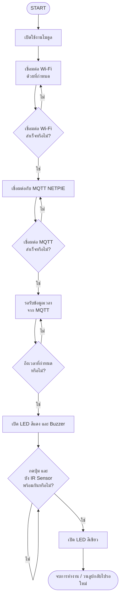

```mermaid
flowchart TD
    A([START]) --> B[เปิดใช้งานโมดูล]
    B --> C[เชื่อมต่อ Wi-Fi<br/>ด้วยที่กำหนด]
    C --> D{เชื่อมต่อ Wi-Fi<br/>สำเร็จหรือไม่?}
    D -- ไม่ --> C
    D -- ใช่ --> E[เชื่อมต่อกับ MQTT NETPIE]
    E --> F{เชื่อมต่อ MQTT<br/>สำเร็จหรือไม่?}
    F -- ไม่ --> E
    F -- ใช่ --> G[รอรับข้อมูลเวลา<br/>จาก MQTT]
    G --> H{ถึงเวลาที่กำหนด<br/>หรือไม่?}
    H -- ไม่ --> G
    H -- ใช่ --> I[เปิด LED สีแดง และ Buzzer]
    I --> J{กดปุ่ม และ<br/>บัง IR Sensor<br/>พร้อมกันหรือไม่?}
    J -- ไม่ --> J
    J -- ใช่ --> K[เปิด LED สีเขียว]
    K --> L([จบการทำงาน / วนลูปกลับไปรอใหม่])

```
